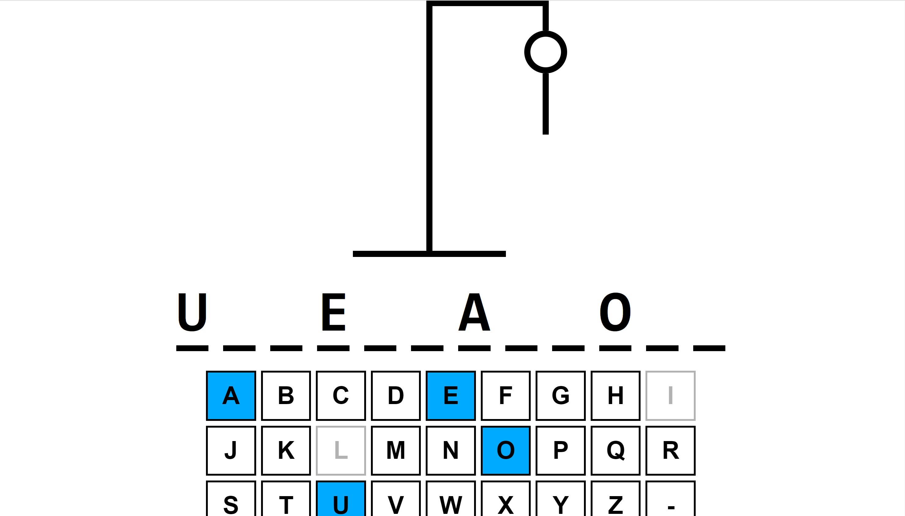

# Hangman Game



Welcome to the Hangman Game! This project is a simple implementation of the classic Hangman word guessing game using Vite, TypeScript, React, and an external word API. Test your word-guessing skills and have fun!

## Table of Contents
- [Features](#features)
- [Technologies Used](#technologies-used)
- [Credits](#credits)
- [Getting Started](#getting-started)
  - [Prerequisites](#prerequisites)
  - [Installation](#installation)
- [Usage](#usage)
- [Game Rules](#game-rules)

## Features

- Random word generation using an external word API.
- Developed with Vite, TypeScript, and React for a modern and efficient development experience.
- Interactive gameplay with a user-friendly interface.
- Real-time feedback on guessed letters and remaining attempts.
- Simple and intuitive design.

## Technologies Used

- [Vite](https://vitejs.dev/)
- [TypeScript](https://www.typescriptlang.org/)
- [React](https://reactjs.org/)
- [WordsAPI](https://rapidapi.com/dpventures/api/wordsapi/)

## Credits

This project was inspired by the Hangman Game tutorial by [Web Dev Simplified](https://www.youtube.com/watch?v=-ONUyenGnWw&t=238s) on YouTube. While following the tutorial, I customized the project by integrating a third-party word API to add a unique touch to the game.

## Getting Started

Follow these steps to set up and run the Hangman Game on your local machine.

### Prerequisites

Before you begin, ensure you have the following dependencies installed:

- [Node.js](https://nodejs.org/)
- [npm](https://www.npmjs.com/)

### Installation
1. Install Vite

   ```bash
   `npm install -g create-vite`

2. Clone the repository:

   ```bash
   `git clone https://github.com/MercyAkindele/react-typescript-hangman-vite.git`

3. Navigate to the project directory

   ```bash
   `react-typescript-hangman-vite`

4. Install the projects dependencies
   ```bash
   `npm install`

## Usage
1. Start the development server
   ```bash
   `npm run dev`

2. Open your web browser and visit the local host provided to play the Hangman Game.

## Game Rules
- The game selects a random word from the third-party word API, and the player's goal is to guess the word letter by letter.
- Use the keyboard or your mouse to pick letters or the hyphen.
- If you get the charcter correct, the keyboard character will light up blue.
- If you get the character wrong, the keyboard character will be grayed out and a limb will be placed on the hanger.